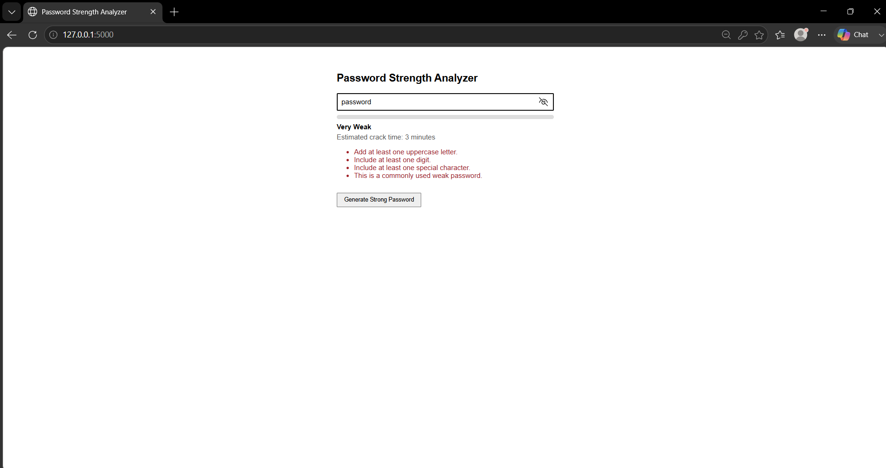

# Cybersecurity Internship Projects

A collection of four Flask-based web applications designed for cybersecurity education and awareness training. Each project focuses on a different aspect of security: cryptography, password security, phishing awareness, and vulnerability scanning.

## Overview

These projects were developed as part of a cybersecurity internship to provide hands-on learning experiences with various security concepts. Each project is intentionally simplified for educational purposes while demonstrating real-world techniques and defenses.

## Projects

### 1. [Password Strength Analyzer](./password-strength-analyzer/)
**Flask-based password strength checker.**

Evaluates password strength based on length, character variety, and resistance to brute-force attacks. Provides specific feedback for improvement and estimates crack time assuming offline attack scenarios.

Key Features:
- Password scoring system (0-4 points based on criteria)
- Feedback for missing character types
- Common weak password detection
- Crack time estimation (seconds to years)
- Secure password generation
- Web interface for interactive testing



### 2. [Encryption/Decryption Tool](./encryption-decryption-tool/)
**Flask-based Fernet encryption/decryption demo.**

Demonstrates both symmetric (AES) and asymmetric (RSA) encryption algorithms with a performance comparison tool.

Key Features:
- AES-256 encryption/decryption with PBKDF2 key derivation
- RSA-OAEP encryption/decryption with 2048-bit keys
- Performance benchmark comparing AES vs RSA speeds
- Web interface for testing encryption/decryption
- Educational explanations of cryptographic concepts

### 3. [Phishing Email Simulation](./phishing-email-simulation/)
**Local phishing-awareness training simulation.**

Simulates realistic phishing campaigns in a controlled environment for security awareness training. Tracks user interactions to measure training effectiveness without collecting real credentials.

Key Features:
- Three realistic phishing scenarios (invoice scam, HR policy, password reset)
- Email preview and educational landing pages
- Click tracking and logging for training metrics
- Dashboard for viewing interaction data
- Emphasis on educational use only with clear disclaimers

### 4. [Vulnerability Scanner](./vulnerability-scanner/)
**Flask-based port and service scanner.**

Scans common ports on target hosts and attempts to retrieve service banners for basic vulnerability assessment and service identification.

Key Features:
- TCP connect scanning of common ports (21, 22, 23, 25, 53, 80, 110, 143, 443, 445, 3306, 3389, 8080)
- Banner grabbing for service version detection
- Service identification with security notes
- Web interface with real-time results display
- Host validation via DNS resolution

## Running the Projects

Each project is self-contained and can be run independently:

```bash
# Navigate to project directory
cd project-folder-name

# Create virtual environment (optional but recommended)
python -m venv venv
source venv/bin/activate  # On Windows: venv\Scripts\activate

# Install dependencies
pip install -r requirements.txt

# Run the application
python main.py

# Open browser to the displayed address (typically http://127.0.0.1:PORT)
```

Each project runs on a different port:
- Password Strength Analyzer: Port 5000
- Encryption/Decryption Tool: Port 5001  
- Phishing Email Simulation: Port 5002
- Vulnerability Scanner: Port 5003

## Educational Purpose

These projects are designed to teach cybersecurity concepts through hands-on experience:

### Cryptography Concepts (Encryption/Decryption Tool)
- Symmetric vs asymmetric encryption
- Key derivation functions (PBKDF2)
- Block cipher modes (CBC)
- RSA padding schemes (OAEP)
- Performance trade-offs

### Authentication Security (Password Strength Analyzer)
- Password entropy and strength factors
- Brute-force attack concepts
- Importance of character variety
- Risks of common passwords
- Benefits of password managers

### Social Engineering Defense (Phishing Simulation)
- Phishing identification techniques
- Email header analysis
- Link inspection best practices
- Psychological manipulation tactics
- Reporting procedures

### Network Security (Vulnerability Scanner)
- Port scanning fundamentals
- Service fingerprinting
- Banner information disclosure
- Commonly exploited services
- Network reconnaissance basics

## Authorization & Ethical Use

⚠️ **CRITICAL: AUTHORIZATION REQUIRED**

- **Vulnerability Scanner**: Only use against systems you own or have explicit written permission to test. Unauthorized scanning may violate laws (CFAA in US, Computer Misuse Act in UK, etc.) and organizational policies.
  
- **Phishing Simulation**: Only deploy for authorized security awareness training with explicit consent from participants and organizational approval. Never use to collect real credentials or for malicious purposes.

- **All Projects**: These tools are intended for educational and authorized security testing purposes only. Always:
  - Obtain proper authorization before testing any systems
  - Respect privacy and data protection laws
  - Use in isolated/test environments when possible
  - Follow responsible disclosure practices if vulnerabilities are discovered
  - Consider attending authorized training (CEH, OSCP, etc.) for professional penetration testing

## Project Structure

```
cybersecurity-internship-projects/
├── README.md                 # This file
├── encryption-decryption-tool/
│   ├── main.py               # Flask app with AES/RSA encryption
│   ├── templates/
│   │   └── index.html        # Web interface
│   ├── requirements.txt      # Python dependencies
│   └── README.md             # Detailed project documentation
├── password-strength-analyzer/
│   ├── main.py               # Flask app with password analysis
│   ├── templates/
│   │   └── index.html        # Web interface
│   ├── requirements.txt      # Python dependencies
│   └── README.md             # Detailed project documentation
├── phishing-email-simulation/
│   ├── main.py               # Flask app with phishing simulation
│   ├── templates/
│   │   ├── index.html        # Home page
│   │   ├── [email templates] # phishing_email_*.html
│   │   └── [landing pages]   # *_landing.html
│   ├── click_log.json        # Generated at runtime (click tracking)
│   ├── session_log.json      # Additional logging
│   ├── analyze_clicks.py     # Optional click analysis script
│   ├── requirements.txt      # Python dependencies
│   └── README.md             # Detailed project documentation
└── vulnerability-scanner/
    ├── main.py               # Flask app with port scanning logic
    ├── templates/
    │   └── index.html        # Web interface with AJAX scanning
    ├── requirements.txt      # Python dependencies
    └── README.md             # Detailed project documentation
```

## Dependencies

All projects use Flask as the web framework. Individual requirements are listed in each project's `requirements.txt` file:

- Flask==2.3.2
- Projects with additional dependencies:
  - Encryption/Decryption Tool: pycryptodome==3.18.0

To install dependencies for any project:
```bash
pip install -r requirements.txt
```

## Learning Outcomes

By studying and running these projects, users will gain practical understanding of:

1. **Cryptographic Principles**: How encryption algorithms work, when to use symmetric vs asymmetric, key management concepts
2. **Authentication Security**: What makes passwords strong/weak, how attackers crack passwords, defense strategies
3. **Social Engineering Awareness**: How phishing attacks work, psychological tactics used, how to recognize and defend against them
4. **Network Security Fundamentals**: How port scanners work, what information services expose, basic network reconnaissance and defense

## Customization & Extension

Each project is designed to be extensible for further learning:

- Add more encryption algorithms or modes to the encryption tool
- Enhance password analyzer with additional rules (passphrases, breach checks)
- Expand phishing simulation with more sophisticated scenarios or training modules
- Enhance vulnerability scanner with additional scan types, service fingerprinting, or vulnerability checking

These projects provide a foundation for exploring cybersecurity concepts and can be adapted for classroom demonstrations, self-study, or security awareness training programs.

---
*Developed as part of a cybersecurity internship educational project. For educational use only.*
